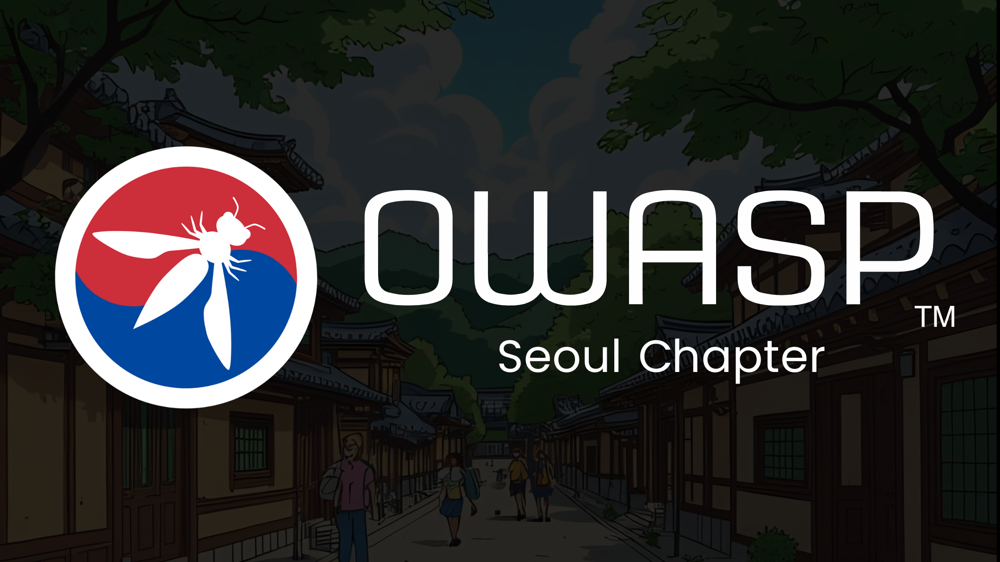

<iframe width="100%" src="https://www.youtube.com/embed/iA1oKgw36PY?si=g4BeiKdgrNsnQZWZ" title="YouTube video player" frameborder="0" allow="accelerometer; autoplay; clipboard-write; encrypted-media; gyroscope; picture-in-picture; web-share" referrerpolicy="strict-origin-when-cross-origin" allowfullscreen ></iframe>
 

 

# Introduction
OWASP Seoul Chapter는 웹 애플리케이션을 포함한 다양한 애플리케이션의 보안 향상을 위해 문서 발간, 프로젝트 운영, 세미나 및 컨퍼런스 등의 행사를 개최하고 있으니 국내ㆍ외 소프트웨어 개발자와 정부기관 및 기업에서 많은 관심과 지원을 바랍니다.

Seoul Chapter는 2011년 1월부터 운영하고 있으며 OWASP Korea Chapter 1기, 2013년 6월 2기, 2015년 2월 3기로 운영하였고, 2019년 3월 부터 OWASP Seoul Chapter로 재시작하게 되었습니다. 2025년 6월 1일부터 새로운 5기 운영진을 구성하여 현재 운영하고 있습니다.

OWASP(Open Worldwide Application Security Project, 오와스프)는 소프트웨어 보안 향상에 중점을 둔 전 세계 비영리 자선 단체입니다. 저희의 목표는 소프트웨어 보안에 대해서 투명하게 공개하여 개인과 조직이 정보에 입각한 결정을 내릴 수 있도록 하는 것입니다. OWASP는 개인, 기업, 대학, 정부 기관 등 전 세계 다양한 조직에 대해 공정하고 실용적인 애플리케이션 보안 정보를 제공하려고 하고 있습니다. OWASP는 비슷한 목표를 가진 전문가들이 모여 커뮤니티가 되어 함께 운영되며, 애플리케이션 보안 관련 소프트웨어 도구와 문서를 제공합니다.
OWASP 서울 챕터는 멤버 간 협업을 위한 Slack 채널과 카카오톡 오픈채팅방을 운영하고 있습니다.

OWASP Slack 그룹에 참여하려면 [초대 링크](https://owasp.org/slack/invite){: target="_blank"}를 사용하시고, 서울 챕터 채널(#chapter-Seoul)에 입장하세요.
서울 챕터 카카오톡 오픈채팅방 참여하기: [링크](https://open.kakao.com/o/gS5IxXxh){: target="_blank"}
서울 챕터 링크드인  그룹 참여하기: [링크](https://www.linkedin.com/groups/14865013/)

OWASP Seoul Chapter, free to join, open to all. We meet to discuss & demonstrate application security, tools & solutions.

The Seoul Chapter has been operating since January 2011, with the first term as the OWASP Korea Chapter. The second term started in June 2013, and the third term began in February 2015. In March 2019, it was restarted as the OWASP Seoul Chapter. As of June 1, 2025, the fifth team has been formed and is currently managing the chapter.

The Open Worldwide Application Security Project (OWASP®) is a 501(c)(3) worldwide not-for-profit charitable organization focused on improving the security of software. Our mission is to make software security visible so individuals and organizations can make informed decisions. OWASP is uniquely positioned to provide impartial, practical information about AppSec to individuals, corporations, universities, government agencies, and other organizations worldwide. Operating as a community of like-minded professionals, OWASP issues software tools and knowledge-based documentation on application security.

The OWASP Seoul Chapter has a Slack channel and a Kakaotalk open chat for member collaboration.

Use invite to join the OWASP Slack group - [link](https://owasp.org/slack/invite){: target="_blank"} and join the Seoul Chapter channel - #chapter-Seoul
Join the Seoul Chapter KakaoTalk open chat - [link](https://open.kakao.com/o/gS5IxXxh){: target="_blank"}
Join the LinkedIn Group - [link](https://www.linkedin.com/groups/14865013/)

# Meetup Events
---  
예정된 밋업 정보 입니다. [(https://www.meetup.com/OWASP-Seoul)](https://www.meetup.com/OWASP-Seoul){: target="_blank"}



 
 

---  
#### * 지난 행사와 관련된 정보는 Past events 탭에서 확인하실 수 있습니다.

  
