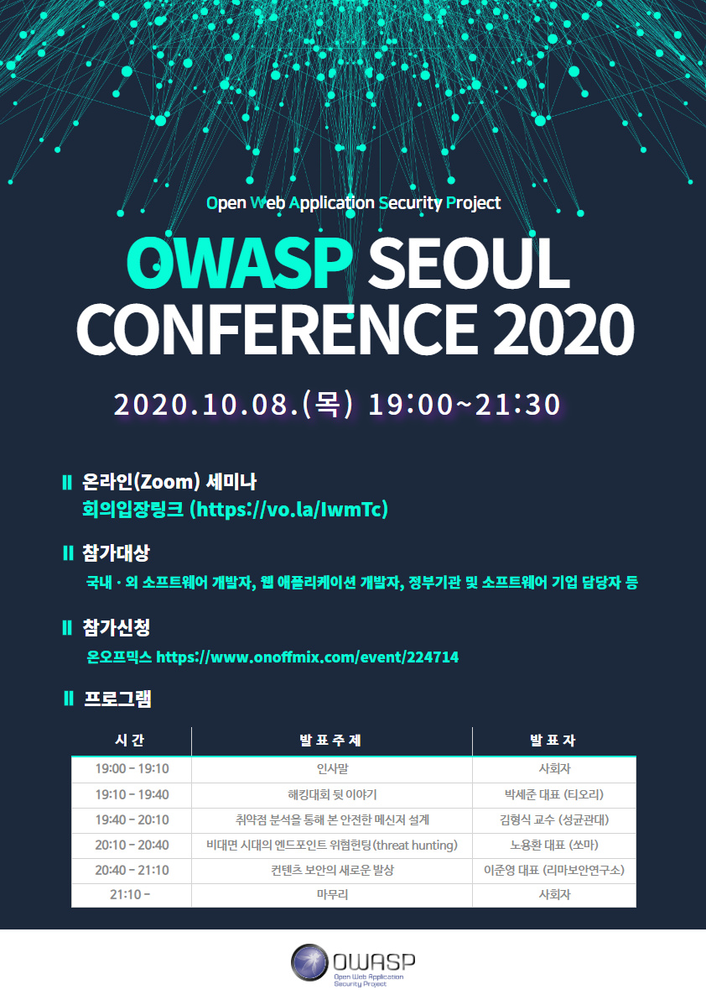
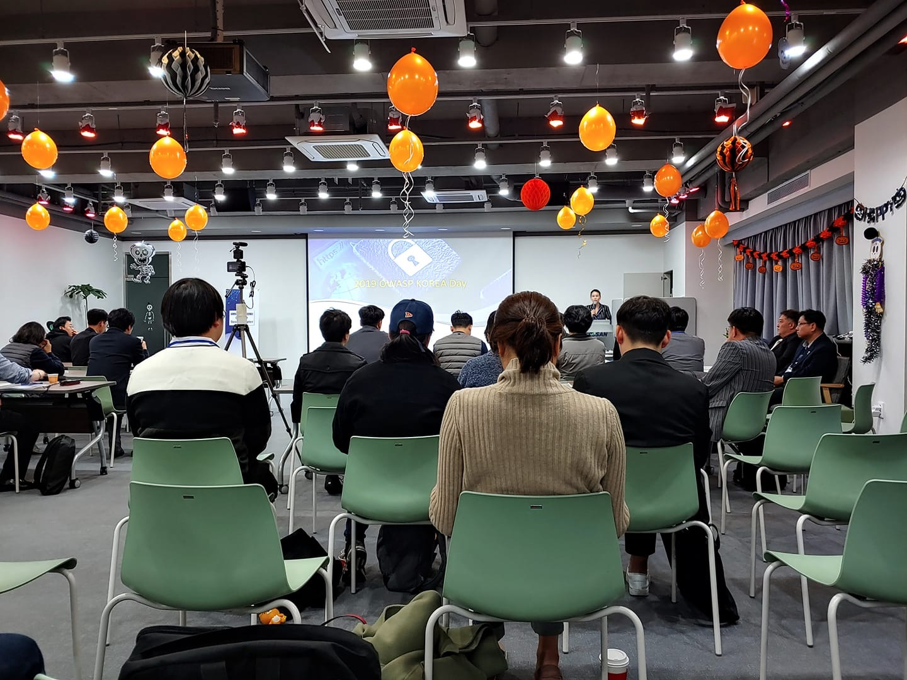

# Introduction  
---  

OWASP (Open Web Application Security Project)는 전 세계 기업, 교육기관 및 개인이 만들어가는 오픈 소스 어플리케이션 보안 프로젝트로서 1984년 4월 안전한 웹 및 응용을 개발할 수 있도록 지원하기 위해 미국에서 비영리 단체로 출발하였습니다. OWASP는 중립적, 실무적이면서도 비용 효과적인 어플리케이션 보안 가이드라인을 무료로 제공하고 있으며, 이러한 가이드라인은 지난 10년간 웹 및 어플리케이션 보안분야에서 사실 표준이 되고 있으며 지금도 발전하고 있습니다. 
 
저희 Chapter는 2010년 11월 설립 위원회를 구성하여 첫 회의 후, 2011년 1월부터 OWASP Korea Chapter 1기 운영진, 2013년 6월 2기 운영진, 2015년 2월 3기 운영진으로 운영되다가 한동안 공백기가 있었으나, 2018년 7월 4기 운영진을 재구성하여 본부에 재시작 요청하였으며, 이에 2019년 3월 OWASP Seoul Chapter로서 재시작하게 되었습니다. 
 
OWASP Seoul Chapter는 국내 소프트웨어, 애플리케이션, 웹 보안 향상을 위해 각종 문서 발간, 프로젝트 진행, 워크샵, 세미나 및 컨퍼런스 등의 행사를 개최하고 있사오니 국내ㆍ외 소프트웨어 개발자, 웹 애플리케이션 개발자, 정부기관 및 소프트웨어 기업에서 많은 관심과 지원을 바랍니다.

 
 
# Recent News  
---  
#### * 2020년 10월 08일 : OWASP Seoul Conference 2020 개최  
  - 행사일시 : 2020년 10월 08일(금), 19:00 ~ 21:30
  - 행사장소 : 온라인(Zoom)
  - 참가대상 : 국내외 소프트웨어 개발자, 웹 애플리케이셔 개발자, 정부기관 및 소프트웨어 기업 담당자 등
  - 참가신청 : https://www.onoffmix.com/event/224714
  - 참가비용 : 무료

#### * 2020년 03월 07일 : OWASP Mobile Application Security Verification Standard(MASVS) v1.2 릴리스 ([다운로드](https://github.com/OWASP-Seoul/owasp/blob/master/OWASP%20Project/OWASP_MASVS-1.2-ko.pdf))
#### * 2019년 11월 2일 : OWASP Korea Day 2019 개최  

  - 행사일시 : 2019년 11월 02일(토), 13:30 ~ 20:00
  - 행사장소 : 서울시 강남구 밤고개로5길 13 수산빌딩 지하1층 대회의실, [위치](http://naver.me/5O4wOPys){: target="_blank"} (지하철 3호선/분당선 수서역 1,4번 출구)
  - 행사후원 : [(주)수산아이앤티](https://www.soosanint.com/){: target="_blank"}, [한국CISSP협회](https://isc2chapter.kr){: target="_blank"} 
  - 발표자료 :
    - OWASP 연혁 및 활동 계획 - 최형순 대표리더(챕터 분과) : [다운로드](https://github.com/OWASP-Seoul/owasp-event/raw/master/OWASP%20Korea%20Day%202019/OWASP%20Korea%20Day%202019.ppt)
    - OWASP 프로젝트 소개 - 전영재 리더(프로젝트 분과) : [다운로드](https://github.com/OWASP-Seoul/owasp-event/raw/master/OWASP%20Korea%20Day%202019/OWASP%20Project%20Introduction%20-%20Youngjae_Jeon.pptx)
    - SQL Injection 최신 취약점 사례 - 유현수 팀장(컨퍼런스 분과) : [다운로드](https://github.com/OWASP-Seoul/owasp-event/raw/master/OWASP%20Korea%20Day%202019/OWASP%20Seoul2019.SQL_Injection.pptx)
    - Hypervisor를 이용한 웹 서버 보안 - 정회찬 수석(수산아이앤티) : [다운로드](https://github.com/OWASP-Seoul/owasp-event/raw/master/OWASP%20Korea%20Day%202019/OWASP%20Seoul%20%EB%B0%9C%ED%91%9C_%EC%A0%95%ED%9A%8C%EC%B0%AC.pptx)
    - 오픈검색서비스(OSINT) API를 활용한 보안과 개발 - 조정원 팀장(프로젝트 분과) : [다운로드](https://github.com/OWASP-Seoul/owasp/raw/master/OWASP%20Korea%20Day%202019/%EC%98%A4%ED%94%88%20%EA%B2%80%EC%83%89%20%EC%84%9C%EB%B9%84%EC%8A%A4(OSINT)%20API%EB%A5%BC%20%ED%99%9C%EC%9A%A9%ED%95%9C%20%EB%B3%B4%EC%95%88%EA%B3%BC%20%EA%B0%9C%EB%B0%9C_%EB%B0%B0%ED%8F%AC.pptx)
    - Security by Design - 김영숙 리더(산업 분과) : 다운로드
