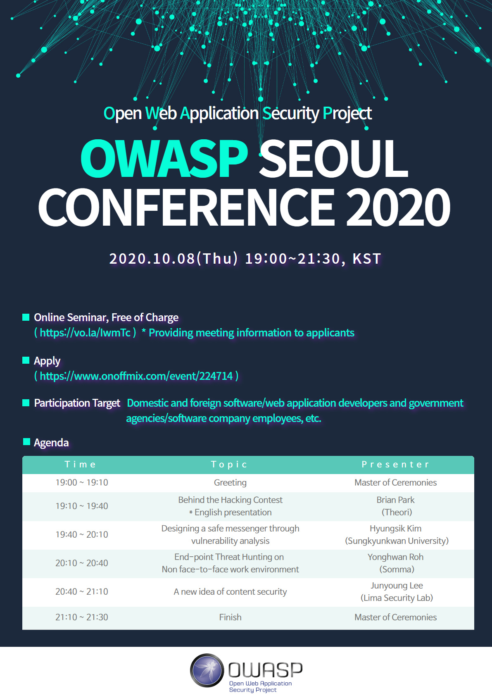

# Introduction  
---  

OWASP (Open Web Application Security Project)는 전 세계 기업, 교육기관 및 개인이 만들어가는 오픈 소스 어플리케이션 보안 프로젝트로서 1984년 4월 안전한 웹 및 응용을 개발할 수 있도록 지원하기 위해 미국에서 비영리 단체로 출발하였습니다. OWASP는 중립적, 실무적이면서도 비용 효과적인 어플리케이션 보안 가이드라인을 무료로 제공하고 있으며, 이러한 가이드라인은 지난 10년간 웹 및 어플리케이션 보안분야에서 사실 표준이 되고 있으며 지금도 발전하고 있습니다. 
 
저희 Chapter는 2010년 11월 설립 위원회를 구성하여 첫 회의 후, 2011년 1월부터 OWASP Korea Chapter 1기 운영진, 2013년 6월 2기 운영진, 2015년 2월 3기 운영진으로 운영되다가 한동안 공백기가 있었으나, 2018년 7월 4기 운영진을 재구성하여 본부에 재시작 요청하였으며, 이에 2019년 3월 OWASP Seoul Chapter로서 재시작하게 되었습니다. 
 
OWASP Seoul Chapter는 국내 소프트웨어, 애플리케이션, 웹 보안 향상을 위해 각종 문서 발간, 프로젝트 진행, 워크샵, 세미나 및 컨퍼런스 등의 행사를 개최하고 있사오니 국내ㆍ외 소프트웨어 개발자, 웹 애플리케이션 개발자, 정부기관 및 소프트웨어 기업에서 많은 관심과 지원을 바랍니다.

 
 

# Recent News  
---  
#### * 2020년 10월 08일 : OWASP Seoul Conference 2020
OWASP 서울 챕터는 국내 소프트웨어, 응용, 웹 보안 향상을 위해 "OWASP SEOUL CONFERENCE 2020" 행사를 아래와 같이 개최하고자 하오니 국내외 소프트웨어 개발자, 웹 응용 개발자 분들의 많은 관심과 참여를 바랍니다. 
OWASP Seoul Chapter intends to hold the "OWASP SEOUL CONFERENCE 2020" event as follows to improve domestic software, application, and web security. We hope that domestic and foreign software developers and web application developers are interested in and participate. 
 
  - 일시(When) : 2020.10.08(Thu) 19:00~21:30, KST
  - 장소(Where) : Online(Zoom) - ([행사입장](https://vo.la/IwmTc){: target="_blank"})
  - 대상(Participation Target)
    - 국내외 소프트웨어/웹 애플리케이션 개발자 및 정부 기관소프트웨어 회사 직원 등
      (Domestic and foreign software/web application developers and government agencies/software company employees, etc.)
  - 신청(Apply) : [https://www.onoffmix.com/event/224714](https://www.onoffmix.com/event/224714){: target="_blank"}
  - 비용(Cost) : 무료(free of charge)
 

 

# Meetup Events:
---  
We are on Meetup. For the list of latest events please join our community [https://www.meetup.com/](https://www.meetup.com/meetup-group-CLBZfMfm/)


