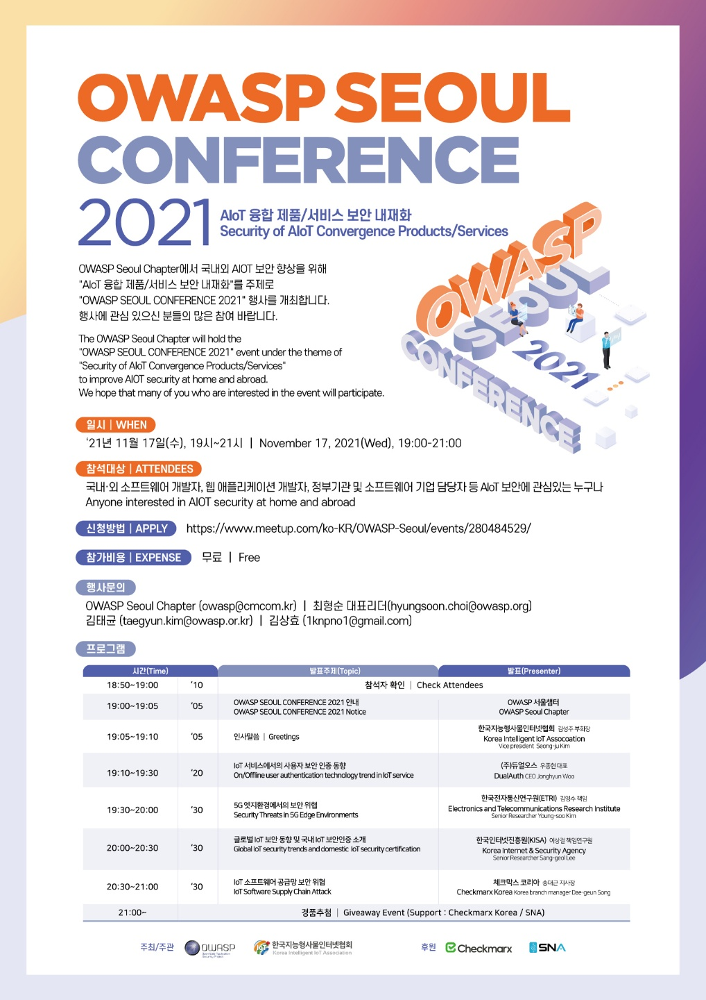

#### * 2021년 11월 17일 : OWASP Seoul Conference 2021
OWASP Seoul Chapter에서 국내외 AIOT 보안 향상을 위해 "AIoT 융합 제품/서비스 보안 내재화"를 주제로 "OWASP SEOUL CONFERENCE 2021" 행사를 개최합니다. 행사에 관심 있으신 분들의 많은 참여 바랍니다.  
The OWASP Seoul Chapter will hold the "OWASP SEOUL CONFERENCE 2021" event under the theme of "Security of AIoT Convergence Products/Services" to improve AIOT security at home and abroad. 
We hope that many of you who are interested in the event will participate.
  

< Event Overview >
  - 일시(When) : 2021.11.17(Wed) 19:00 ~ 21:00, KST
  - 장소(Where) : Online(Zoom) - ([행사종료])
  - 대상(Participation Target)
    - 국내외 AIOT 보안에 관심 있으신 모든 분(Anyone interested in AIOT security at home and abroad)
  - 신청(Apply) : [https://www.meetup.com/ko-KR/OWASP-Seoul/events/280484529/](https://www.meetup.com/ko-KR/OWASP-Seoul/events/280484529/){: target="_blank"}
  - 비용(Cost) : 무료(free of charge)
  

< Event Program >
  - 주제#1 : IoT 서비스에서의 사용자 보안 인증 동향
    - 발표자 : (주)듀얼오스 우종현 대표(DualAuth Jonghyun Woo CEO)
  - 주제#2 : 5G 엣지환경에서의 보안 위협 (Security Threats in 5G Edge Environments)
    - 발표자 : 한국전자통신연구원 김영수 책임 (ETRI Youngsoo Kim Principal Researcher)
    - 발표자료 : [김영수-5G엣지환경에서의 보안위협-OWASP-211117-배포용.pdf](./assets/files/김영수-5G엣지환경에서의 보안위협-OWASP-211117-배포용.pdf){: target="_blank"}
  - 주제#3 : IoT 보안 동향 및 내재화를 위한 국내외 기준
    - 발표자 : 한국인터넷진흥원 이상걸 책임 (KISA Sanggeol Lee Principal Researcher)
  - 주제#4 : IoT 소프트웨어 공급망 보안 위협 (IoT Software Supply Chain Attack)
    - 발표자 : Checkmarx Korea 송대근 지사장 (Greg Song Korea Country Manager)
  

