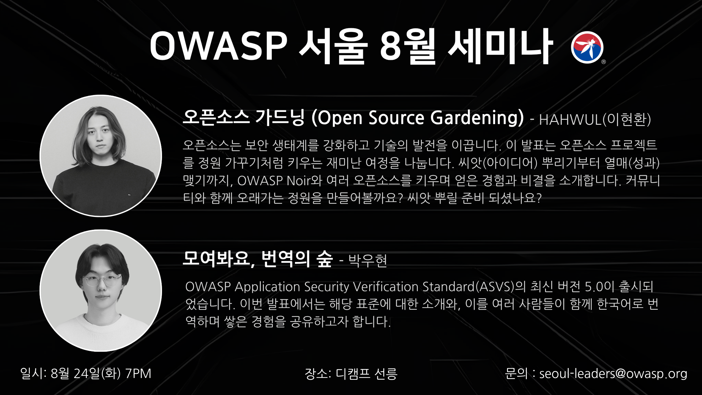

---

title: event2025-8
displaytext: Aug Meetup
layout: col-sidebar
tab: true
order: 1
tags: Seoul

---

# Details
📢 OWASP Seoul Chapter에서 2025년 8월 오프라인 세미나를 개최합니다!

💡 OWASP 서울 챕터의 8월 메인 주제는 보안 오픈소스입니다. 이번 밋업에서는 오픈소스에 기여함으로써 얻을 수 있는 다양한 경험과 가치를 직접 체험해 보실 수 있습니다.
아직 오픈소스 활동에 참여해 보지 않으신 분들도 이번 기회를 통해 첫걸음을 내딛고, 함께 기여하는 즐거움을 느껴보시길 바랍니다.

이번 행사 장소는 오후 7시부터 개방되나, 직전에 진행되는 행사가 동일 시각에 종료될 예정이므로 발표는 오후 7시 30분부터 시작됩니다.

이번 달의 자세한 발표 주제는 아래를 참고해 주세요!

# 🗓️ 프로그램 안내
## 🟡 오프닝 및 챕터 소식 전달 (5분)
- OWASP Foundation 및 Seoul Chapter 소개
- OWASP 최신 소식 전달

## 🔵 주제#1: 오픈소스 가드닝 (Open Source Gardening) (40분)
👨‍💼 HAHWUL(이현환)
오픈소스는 보안 생태계를 강화하고 기술의 발전을 이끕니다. 이 발표는 오픈소스 프로젝트를 정원 가꾸기처럼 키우는 재미난 여정을 나눕니다. 씨앗(아이디어) 뿌리기부터 열매(성과) 맺기까지, OWASP Noir와 여러 오픈소스를 키우며 얻은 경험과 비결을 소개합니다. 커뮤니티와 함께 오래가는 정원을 만들어볼까요? 씨앗 뿌릴 준비 되셨나요?

## 🔵 주제#2: 모여봐요, 번역의 숲 (30분)
👨‍💼 박우현
OWASP Application Security Verification Standard(ASVS)의 최신 버전 5.0이 출시되었습니다. 이번 발표에서는 해당 표준에 대한 소개와, 이를 여러 사람들이 함께 한국어로 번역하며 쌓은 경험을 공유하고자 합니다.

# 📌 세미나 정보

- 📅 일시: 2025년 8월 26일(화) 19:00 ~ 21:00 (KST)
- 📍 장소: 디캠프 선릉 6층(서울특별시 강남구 선릉로 551 새롬빌딩) https://naver.me/502MT5HC (선정릉 역에서 오시는게 가장 접근성이 좋습니다)
- 💰 참가비: 무료
- Meetup 페이지를 통해 참석 신청 부탁드립니다. 회원 가입이 안되시는 분은 앱으로 meetup 앱을 다운로드해서 진행 부탁드립니다. 별도의 멤버십 결제는 요구되지 않습니다.

# 🎉 OWASP Seoul Chapter 커뮤니티 채널 소개
국내 보안 커뮤니티 활성화를 위해 카카오톡 오픈 채팅방과 OWASP Slack을 동시에 사용하고 있습니다.

서울 챕터 카카오톡 오픈채팅방 참여하기: https://open.kakao.com/o/gS5IxXxh
OWASP Slack 그룹에 참여하려면 초대 링크(https://owasp.org/slack/invite)를 통해 가입하신 뒤, 서울 챕터 채널(#chapter-Seoul)에 입장해주세요.

# 💼 발표 및 스폰서 제안

OWASP 서울 챕터에서는 매달 정보 공유를 위한 세미나를 계획 중입니다. 발표 및 스폰서 문의는 seoul-leaders@owasp.org 혹은 카카오톡 혹은 슬랙 채널을 통해 연락 부탁드립니다.
발표 신청 폼 - https://forms.gle/xvEJCjDMEmYr1rKN7
