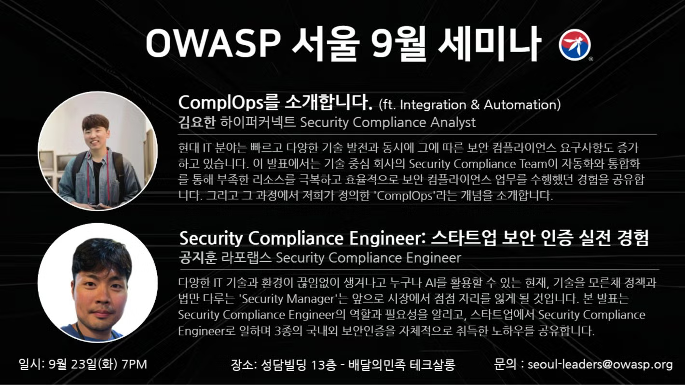

---

title: event2025-9
displaytext: Sep Meetup
layout: col-sidebar
tab: true
order: 1
tags: Seoul

---

# Details
📢 OWASP Seoul Chapter에서 2025년 9월 오프라인 세미나를 개최합니다!

💡 OWASP 서울 챕터의 9월 메인 주제는 모던 보안 컴플라이언스입니다. 이번 밋업에서는 보안 컴플라이언스를 현대화된 방법으로 접근하는 경험들을 나누는 자리를 준비했습니다. 단순한 규제를 넘어 비즈니스에 까지 영향을 끼치는 보안 컴플라이언스를 현대적으로 접근하고 계신 업계 전문가들의 인사이트를 공유할 예정입니다.

중요! 이번 행사 장소가 기존에 진행하던 장소에서 다른 장소로 변경되었습니다. 장소에 대해서 꼭 한번 더 확인 부탁드립니다.

이번 달의 자세한 발표 주제는 아래를 참고해 주세요!

# 🗓️ 프로그램 안내
## 🟡 오프닝 및 챕터 소식 전달 (5분)
- OWASP Foundation 및 Seoul Chapter 소개
- OWASP 최신 소식 전달

## 🔵 주제#1: ComplOps를 소개합니다. (ft. Integration & Automation) (40분)
👨‍💼 김요한 - 하이퍼커넥트 Security Compliance Analyst
현대 IT 분야는 빠르고 다양한 기술 발전과 동시에 그에 따른 보안 컴플라이언스 요구사항도 증가하고 있습니다. 이 발표에서는 기술 중심 회사의 Security Compliance Team이 자동화와 통합화를 통해 부족한 리소스를 극복하고 효율적으로 보안 컴플라이언스 업무를 수행했던 경험을 공유합니다. 그리고 그 과정에서 저희가 정의한 'ComplOps'라는 개념을 소개합니다.

## 🔵 주제#2: Security Compliance Engineer: 스타트업 보안 인증 실전 경험 (30분)
👨‍💼 공지훈 - 라포랩스 Security Compliance Engineer
다양한 IT 기술과 환경이 끊임없이 생겨나고 누구나 AI를 활용할 수 있는 현재, 기술을 모른채 정책과 법만 다루는 'Security Manager'는 앞으로 시장에서 점점 자리를 잃게 될 것입니다. 본 발표는 Security Compliance Engineer의 역할과 필요성을 알리고, 스타트업에서 Security Compliance Engineer로 일하며 3종의 국내외 보안인증을 자체적으로 취득한 노하우를 공유합니다.

# 📌 세미나 정보

- 📅 일시: 22025년 9월 23일(화) 19:00 ~ 21:00 (KST)
📍 장소: 성담빌딩 13층 - 배민 테크살롱 https://naver.me/GmbM1R74 (선릉역에서 가장 가깝습니다)
💰 참가비: 무료
Meetup 페이지를 통해 참석 신청 부탁드립니다. 회원 가입이 안되시는 분은 앱으로 meetup 앱을 다운로드해서 진행 부탁드립니다. 별도의 멤버십 결제는 요구되지 않습니다.

# 🎉 OWASP Seoul Chapter 커뮤니티 채널 소개
국내 보안 커뮤니티 활성화를 위해 카카오톡 오픈 채팅방과 OWASP Slack, 링크드인 그룹을 동시에 사용하고 있습니다.

서울 챕터 카카오톡 오픈채팅방 참여하기: https://open.kakao.com/o/gS5IxXxh
OWASP Slack 그룹에 참여하려면 초대 링크(https://owasp.org/slack/invite)를 통해 가입하신 뒤, 서울 챕터 채널(#chapter-Seoul)에 입장해주세요.
링크드인 참여하기: https://www.linkedin.com/groups/14865013/

# 💼 발표 및 스폰서 제안

OWASP 서울 챕터에서는 매달 정보 공유를 위한 세미나를 계획 중입니다. 발표 및 스폰서 문의는 seoul-leaders@owasp.org 혹은 카카오톡 혹은 슬랙 채널을 통해 연락 부탁드립니다.
발표 신청 폼 - https://forms.gle/xvEJCjDMEmYr1rKN7
